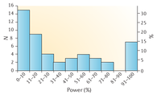
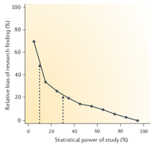
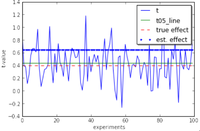
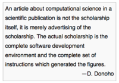

The problem of reproducibility for Imaging genetics
======================================================

Jean-Baptiste Poline  
---------------------

Helen Wills Neuroscience Institute, UC Berkeley

Reproducibility - preliminary remarks
======================================================

* Reminding ourselves : Reproducibility is the backbone of scientific activity
* Reproducibility versus replicability
* Is there a problem ?
  - Not everybody is convinced that there is a problem 
  - Do we have hard evidence ? 

Reproducibility - evidence of the problem
======================================================

* In general: Nature, vol 496, 2013.
    - A new mechanism for independently replicating research findings is needed: Nature Biotechnology 30, 806 (2012)
    - Easy to misinterpret artefacts as biologically important results: Nature 487, 406 (2012) 
    - Too many sloppy mistakes: Nature 483, 509 (2012) 
* In epidemiology
    - Why most research findings are false: Ioannidis Plos Med., 2005
* In social sciences and in psychology
    - Reproducibility Project: Psychology (https://osf.io/ezcuj/wiki/home/)
    - Simmons, J. P., L. D. Nelson, and U. Simonsohn. “False-Positive Psychology: Undisclosed Flexibility in Data Collection and Analysis Allows Presenting Anything as Significant.” 2011. Shows an easy 60% FPR instead of 5%. 
* In cognitive neuroscience
    - Barch, Deanna M., and Tal Yarkoni. “... Special Issue on Reliability and Replication in Cognitive and Affective Neuroscience Research.”  2013.

Reproducibility - evidence of the problem
======================================================

* Cancer Research: 
    - Begley C.G. & Ellis L. Nature, (2012): "6 out of 53 key findings could not be replicated"

* In brain imaging
    - Functional and Structural Neuroimaging: Reproducibility Issues in Multicentre MRI Studies, Jorge Jovicich, Univ. of Trento

* In genetics
    - Cf Jason talk (many old references and warning here, eg:"Drinking from the fire hose ..." by Hunter and Kraft 2007)

* And not in imaging genetics ?

Why do we have a problem? 
===========================
* Things are getting complex
* Publication pressure is high
* Mistakes are done
* Power issues

Why do we have a problem? 
===========================
Things are getting complex
----------------------------------------------------------------
* Data complexity (eg: chip idiosynchrasis, format, preprocessings, etc)
* Data need to be linked appropriately
* Data size: number of variables - files you cannot check visually
* Methods: we have to trust external software
* Methods: complexity higher

Why do we have a problem? 
===========================
Publication pressure is high 
--------------------------------
- There's no way there isnt a paper out of this data set. 
- You will not get your Phd if you don't publish this study
- You won't get tenure 
- You won't get funding and your peers admiration and consideration
- Conclusion: the pressure is *very* high

Why do we have a problem? 
===========================
Mistakes are done
--------------------

The "Mistakes" argument : an unpopular topic.

- Ioannidis 2005
- Anatomy of an Error
- The Left/Right issue
- The ADHD 1000 connectome

The power issue
===================
- Studies of low power have low probability of detecting an effect (duh!)
- Studies of low power have low positive predictive value : $PPV = P(H1 True | detection)$
    - If we have 4 chances over 5 that H0 is true (odd ratio = 1/4), and 1/5 that H1 true, with 30% power we have PPV = 50%.

----------------  ----------- ----------  --------
 odd ratio=0.25   power=0.10,  alpha=0.05 PPV=0.33  
 odd ratio=0.25   power=0.30,  alpha=0.05 PPV=0.60  
 odd ratio=0.25   power=0.50,  alpha=0.05 PPV=0.71  
 odd ratio=0.25   power=0.70,  alpha=0.05 PPV=0.78  
 odd ratio=0.25   power=0.90,  alpha=0.05 PPV=0.82  
----------------  ----------- ----------  --------

The power issue
===================

What is the estimated power in common meta analyses? 
-----------------------------------------------------

The power issue
===================

Studies of low power inflate the detected effect (1)
-----------------------------------------------------

The power issue
===================

Studies of low power inflate the detected effect (2)
----------------------------------------------------

What is specific to Imaging Genetics
=======================================

- Combinaison of imaging and of genetics issues: "AND" (if independant: would probability of getting it rigt would multiply: .7 * .7 = .5)
- The combinaison of having to get very large number of subjects for GWAS and not being able to get them in imaging
- The multiple comparison issues
- The "trendiness" of the field
- The rapidity of the changes
- The capacity to "rationalize findings" (eg: noise in brain images is always interpretable)

What are the solutions: technical
=====================================

- Pre-register hypotheses 
- Statistics: 
    - Always try to get a sense of the power
    - Take the right statistical tool 
    - Meta analysis if you can
    - Replication always
    - Effect size variation estimation (bootstrapping)

What are the solutions: learning 
===================================

- Learn the right tools: 
    - How can I check my code ? How can I go back to a certain state ? (learn git/mercurial, learn git Annex or others)
    - How can others check my analyses? Learn the emerging social open science frameworks
- Learn "one layer below" (A. Martelli)

Train the new generation 
===============================

- Statistics: in depth
- Computing: in depth
- A more collaborative and a more open science model
  - Work such that the next post-doc will need weeks to start progress - not months
  - Work such that others in the community can reproduce **and** build upon

What are the solutions: social 
===================================

* Put some pressure on editors to 
    - Accept replication studies
    - Accept preregistration 
    - Increase the verifiability of analyses (code and data available)
* Share data / share intermediate results 
  - Increase the capacity of the community to verify
  - Increase capacity to do meta/mega analyses 
  - Because we should be more interested in replication and new findings than our own publication record
* Put pressure to change their evaluation criteria - Decrease publication pressure

Conclusion : learn from Donoho et al. 
======================================

